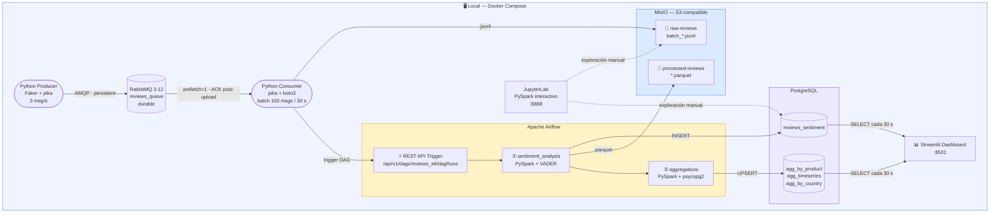

# Guía de Presentación — SentimentFlow
**Duración estimada:** 10-15 minutos · 2 personas

---

## DIAPOSITIVA 1 — Portada

**Contenido:**
- Título: *SentimentFlow — Análisis de Sentimiento de Reseñas en Tiempo Real*
- Asignatura: Big Data
- Nombres del grupo
- Fecha: 6 de mayo de 2026

---

## BLOQUE 1 — Problema planteado y objetivo del proyecto
> **Tiempo estimado: 2 min · Expone: Persona 1**

### Diapositiva 2 — El problema

**Qué contar:**
Una plataforma de e-commerce recibe miles de reseñas de productos cada hora. Procesarlas manualmente es inviable. La empresa necesita saber **en tiempo casi-real** si el sentimiento de sus clientes hacia un producto está siendo positivo, neutro o negativo, para poder reaccionar rápido (alertas, cambios de stock, atención al cliente).

**Posible frase de apertura:**
> *"Imagina que gestionas una tienda online y en un día recibes 10.000 reseñas. ¿Cómo sabes si algo está fallando antes de que se viralice en redes? Eso es exactamente lo que resuelve SentimentFlow."*

### Diapositiva 3 — Objetivo

Construir un pipeline de procesamiento de datos en tiempo casi-real que:
1. Capture reseñas desde una fuente de eventos continua (RabbitMQ).
2. Las procese automáticamente con análisis de sentimiento (PySpark + VADER).
3. Presente los resultados en un dashboard actualizado cada 30 segundos.

---

## BLOQUE 2 — Tecnología utilizada
> **Tiempo estimado: 3 min · Expone: Persona 1 (RabbitMQ) + Persona 2 (pila local)**

### Diapositiva 4 — RabbitMQ

**Para qué sirve en el proyecto:**
- Recibe las reseñas del producer a razón de ~3 msg/s
- Almacena en cola durable hasta que el consumer las procesa
- Actúa de **buffer** ante picos de carga o fallos temporales

**Por qué se eligió:**
- Colas durables y mensajes persistentes: no se pierde ninguna reseña si el broker se reinicia
- ACK manual: el consumer solo confirma cuando la subida a MinIO es exitosa
- Interfaz web para monitorización en directo

### Diapositiva 5 — Pila local open-source

| Servicio | Rol en el proyecto | Reemplaza |
|---|---|---|
| **MinIO** | Data Lake local compatible con S3 | Azure Blob Storage |
| **Apache Airflow** | Orquestación event-driven del pipeline ETL | Azure Data Factory |
| **PySpark local** | Motor de procesamiento y análisis VADER | Azure Databricks |
| **PostgreSQL** | Almacén de resultados para el dashboard | Azure SQL Database |
| **JupyterLab** | Entorno de notebooks interactivos | Databricks Notebooks |

**Por qué esta pila:**
- 100 % open-source, desplegable con un solo `docker compose up`
- Sin coste, sin límites de crédito cloud, reproducible en cualquier máquina
- Arquitecturalmente equivalente a la pila Azure: mismos patrones, mismas garantías

---

## BLOQUE 3 — Arquitectura o flujo de trabajo desarrollado
> **Tiempo estimado: 3 min · Expone: Persona 2**

### Diapositiva 6 — Diagrama de arquitectura



### Diapositiva 7 — Paso a paso del flujo

1. El **Producer** genera reseñas sintéticas y las publica en RabbitMQ.
2. **RabbitMQ** las almacena en cola durable; el consumer las lee de una en una (fair dispatch).
3. El **Consumer** acumula 100 mensajes y sube un fichero `.jsonl` a MinIO. Solo hace ACK a RabbitMQ cuando la subida confirma éxito → garantía *at-least-once*. Luego llama a la REST API de Airflow para activar el DAG.
4. **Airflow** ejecuta el DAG `reviews_etl`:
   - Task 1: descarga el `.jsonl`, procesa con PySpark, aplica VADER, escribe en PostgreSQL y sube Parquet a MinIO.
   - Task 2: calcula agregados y actualiza las tablas del dashboard.
5. El **dashboard Streamlit** consulta PostgreSQL cada 30 s y actualiza KPIs, gráficas y mapa.

---

## BLOQUE 4 — Demo o evidencias de funcionamiento
> **Tiempo estimado: 3 min · Expone: ambos**

### Diapositiva 8 — Demo en vivo

**Orden sugerido:**

1. **RabbitMQ Management UI** (`http://localhost:15672`)
   - Cola `reviews_queue` con mensajes en tránsito
   - Señalar: "Ready" = mensajes acumulados, "Unacked" = siendo procesados

2. **MinIO Console** (`http://localhost:9001`)
   - Bucket `raw-reviews` con ficheros `batch_*.jsonl`
   - Abrir uno y mostrar el JSON de una reseña

3. **Airflow UI** (`http://localhost:8080`)
   - DAG `reviews_etl` con varias ejecuciones exitosas (verde)
   - Señalar las dos tareas y el tiempo de ejecución

4. **JupyterLab** (`http://localhost:8888`)
   - Abrir `01_sentiment_analysis.ipynb`
   - Mostrar el output de distribución de sentimiento

5. **PostgreSQL** (desde Jupyter o terminal)
   ```sql
   SELECT sentiment_label, COUNT(*) FROM reviews_sentiment GROUP BY 1;
   ```

6. **Dashboard Streamlit** (`http://localhost:8501`)
   - Recorrer KPIs → barras → serie temporal → mapa de países

---

## BLOQUE 5 — Problemas encontrados y soluciones aplicadas
> **Tiempo estimado: 1,5 min · Expone: cada persona explica los suyos**

### Diapositiva 9 — Retos técnicos

| # | Problema | Quién | Solución |
|---|---|---|---|
| 1 | Consumer hacía ACK antes de confirmar subida → pérdida de mensajes | P1 | Mover el ACK **dentro** del bloque de éxito de `s3.put_object()` |
| 2 | Airflow tardaba en arrancar; el consumer intentaba triggearlo antes | P1 | `healthcheck` en airflow-webserver + `condition: service_healthy` |
| 3 | ADF Storage Event Trigger no tiene equivalente nativo en MinIO | P1+P2 | Llamada a REST API de Airflow desde el consumer tras cada subida |
| 4 | Schema T-SQL incompatible con PostgreSQL (`GO`, `NVARCHAR`, `IDENTITY`) | P2 | Reescritura completa del DDL en sintaxis PostgreSQL estándar |
| 5 | VADER analiza inglés; las reseñas son en español → scores neutros | P2 | Documentado como limitación; mejora propuesta: `pysentimiento` |

---

## BLOQUE 6 — Conclusiones y posibles mejoras
> **Tiempo estimado: 1,5 min**

### Diapositiva 10 — Conclusiones

- Pipeline end-to-end funcional: desde la mensajería hasta el dashboard, sin servicios cloud de pago.
- La pila local (MinIO + Airflow + PySpark + PostgreSQL) demuestra los mismos patrones arquitectónicos que las plataformas cloud empresariales.
- El desacoplamiento entre capas hace el sistema tolerante a fallos: si PySpark falla, los mensajes siguen en RabbitMQ y Airflow reintenta automáticamente.

### Diapositiva 11 — Posibles mejoras

- **Latencia menor:** Apache Kafka + Spark Structured Streaming → latencia de segundos.
- **NLP en español:** `pysentimiento` para mayor precisión que VADER.
- **Calidad de datos:** validación con Great Expectations antes de escribir en PostgreSQL.
- **Portabilidad cloud:** sustituir MinIO → S3, PostgreSQL → RDS, Airflow → MWAA, cambiando solo las variables de entorno.

---

## Diapositiva 12 — Cierre

- *"¿Preguntas?"*
- Diagrama de arquitectura de nuevo (resumen visual)

---

## Checklist antes de la defensa

- [ ] `docker compose up -d` arrancado y todos los servicios `healthy`
- [ ] Producer generando mensajes visibles en RabbitMQ Management UI
- [ ] Al menos 3-4 ficheros `.jsonl` en MinIO `raw-reviews`
- [ ] Airflow con al menos una ejecución exitosa del DAG `reviews_etl`
- [ ] PostgreSQL con filas en `reviews_sentiment` y en las tablas `agg_*`
- [ ] Dashboard Streamlit mostrando datos reales (no pantalla vacía)
- [ ] Capturas de pantalla de respaldo por si falla algo el día de la defensa
- [ ] Cronometrar la presentación: no superar 13 min
