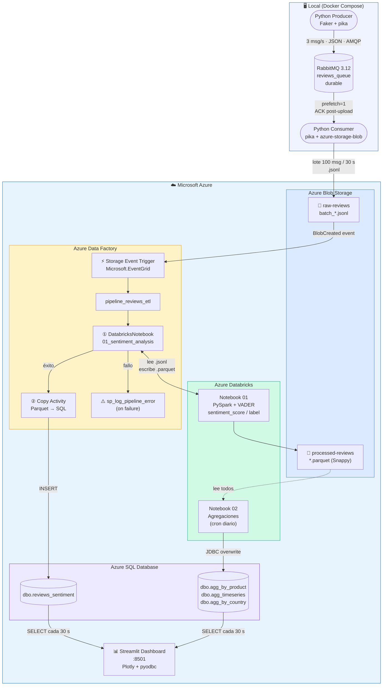
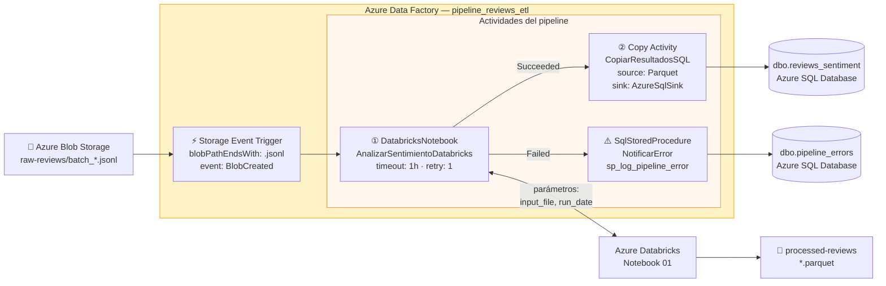
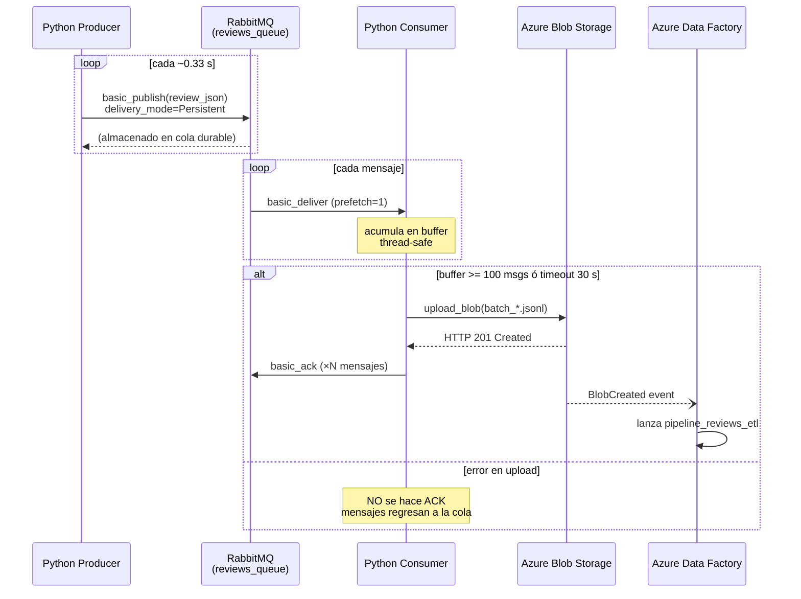
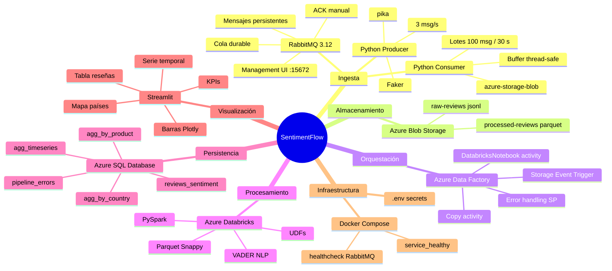
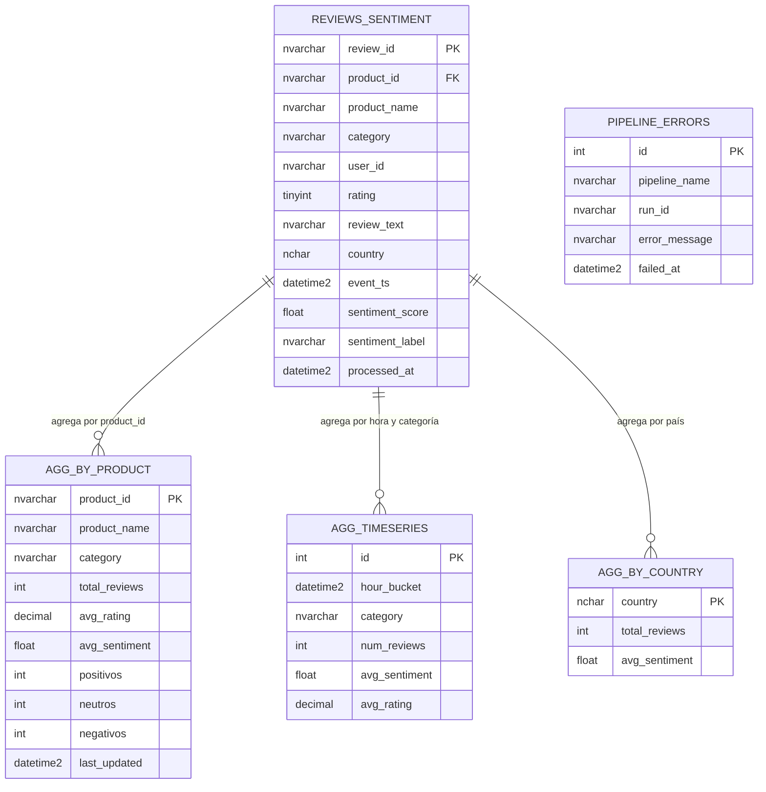

# Guía de Presentación — SentimentFlow
**Duración estimada:** 10-15 minutos · 2 personas

---

## DIAPOSITIVA 1 — Portada

**Contenido:**
- Título: *SentimentFlow — Análisis de Sentimiento de Reseñas en Tiempo Real*
- Asignatura: Big Data
- Nombres del grupo
- Fecha: 6 de mayo de 2026

---

## BLOQUE 1 — Problema planteado y objetivo del proyecto
> **Tiempo estimado: 2 min · Expone: Persona 1**

### Diapositiva 2 — El problema

**Qué contar:**
Una plataforma de e-commerce recibe miles de reseñas de productos cada hora. Procesarlas manualmente es inviable. La empresa necesita saber **en tiempo casi-real** si el sentimiento de sus clientes hacia un producto está siendo positivo, neutro o negativo, para poder reaccionar rápido (alertas, cambios de stock, atención al cliente).

**Puntos clave a mencionar:**
- Volumen alto y continuo de datos (streaming, no batch clásico)
- Necesidad de análisis automático de texto (NLP)
- Necesidad de visualización actualizada para la toma de decisiones

**Posible frase de apertura:**
> *"Imagina que gestionas una tienda online y en un día recibes 10.000 reseñas. ¿Cómo sabes si algo está fallando antes de que se viralice en redes? Eso es exactamente lo que resuelve SentimentFlow."*

### Diapositiva 3 — Objetivo

**Qué contar:**
Construir un pipeline de procesamiento de datos en tiempo casi-real que:
1. Capture reseñas de productos desde una fuente de eventos continua (RabbitMQ).
2. Las procese automáticamente con análisis de sentimiento (VADER en Databricks).
3. Presente los resultados en un dashboard actualizado cada 30 segundos.

---

## BLOQUE 2 — Tecnología utilizada: qué es, para qué sirve y por qué se ha elegido
> **Tiempo estimado: 3 min · Expone: Persona 1 (RabbitMQ) + Persona 2 (Azure)**

### Diapositiva 4 — RabbitMQ

**Qué es:**
Broker de mensajería open-source que implementa el protocolo AMQP. Actúa como intermediario entre quien produce datos y quien los consume.

**Para qué sirve en el proyecto:**
- Recibe las reseñas del producer a razón de ~3 msg/s
- Las almacena en una cola durable hasta que el consumer las procesa
- Actúa de **buffer** ante picos de carga o fallos temporales en Azure

**Por qué se eligió:**
- Colas **durables** y mensajes **persistentes**: no se pierde ninguna reseña aunque el broker se reinicie
- ACK manual: el consumer solo confirma el mensaje cuando la subida a Azure ha sido exitosa
- Interfaz de administración web para monitorización en directo (mostrar en demo)
- Muy usado en arquitecturas Big Data reales como capa de ingesta desacoplada

### Diapositiva 5 — Ecosistema Azure (ADF + Databricks + SQL)

**Qué es cada pieza:**

| Servicio | Rol en el proyecto |
|---|---|
| **Azure Blob Storage** | Data Lake: zona `raw` (`.jsonl`) y zona `processed` (`.parquet`) |
| **Azure Data Factory** | Orquestador ETL: dispara el pipeline al detectar un fichero nuevo |
| **Azure Databricks** | Motor de procesamiento (PySpark + VADER) para análisis de sentimiento |
| **Azure SQL Database** | Almacén de resultados que alimenta el dashboard |

**Por qué se eligió ADF:**
- Trigger por evento de Storage: reacciona automáticamente cuando llega un fichero, sin polling
- Serverless: no hay scheduler que gestionar
- Reintento automático y auditoría de errores nativa

**Por qué se eligió Databricks:**
- PySpark escala a millones de reseñas
- VADER: modelo NLP preentrenado, ligero y sin coste, ideal para textos cortos
- Notebooks reproducibles y versionables

---

## BLOQUE 3 — Arquitectura o flujo de trabajo desarrollado
> **Tiempo estimado: 3 min · Expone: Persona 2**

### Diapositiva 6 — Diagrama de arquitectura

#### Diagrama 1 — Arquitectura general (flowchart)

---

#### Diagrama 2 — Pipeline ADF en detalle (flowchart)

---

#### Diagrama 3 — Flujo de mensajes RabbitMQ (sequence diagram)

---

#### Diagrama 4 — Componentes y tecnologías (mindmap)

---

#### Diagrama 5 — Modelo de datos simplificado (entity relationship)

### Diapositiva 7 — Paso a paso del flujo

**Qué contar (numerado, breve):**

1. El **Producer** genera reseñas sintéticas (producto, rating, texto, país) y las publica en RabbitMQ.
2. **RabbitMQ** las almacena en cola durable; el consumer las lee de una en una (fair dispatch).
3. El **Consumer** acumula 100 mensajes en un buffer thread-safe y sube un fichero `.jsonl` a Azure Blob. Solo hace ACK a RabbitMQ cuando la subida confirma éxito → garantía *at-least-once*.
4. El **Storage Event Trigger** de ADF detecta el nuevo fichero y lanza el pipeline automáticamente.
5. **ADF ejecuta el notebook de Databricks**: limpia texto, calcula score VADER (−1 a +1), clasifica en Positivo/Neutro/Negativo y escribe Parquet.
6. **ADF copia** el Parquet a Azure SQL Database.
7. El **dashboard Streamlit** consulta SQL cada 30 s y actualiza KPIs, gráficas y mapa.

---

## BLOQUE 4 — Demo o evidencias de funcionamiento
> **Tiempo estimado: 3 min · Expone: ambos**

### Diapositiva 8 — Demo en vivo (o capturas si no hay conectividad)

**Orden sugerido para la demo:**

1. **RabbitMQ Management UI** (`http://localhost:15672`)
   - Mostrar la cola `reviews_queue` con mensajes en tránsito
   - Señalar: "Ready" = mensajes acumulados, "Unacked" = siendo procesados

2. **Azure Blob Storage** (Portal Azure o Storage Explorer)
   - Contenedor `raw-reviews` → varios ficheros `batch_*.jsonl`
   - Abrir uno y mostrar el JSON de una reseña

3. **Azure Data Factory** — Monitor
   - Mostrar el historial de ejecuciones del pipeline con estado "Succeeded" (verde)
   - Señalar el tiempo de ejecución de cada actividad

4. **Azure Databricks** — Notebook 01
   - Mostrar el output de la celda de estadísticas: distribución de sentimiento del último lote

5. **Azure SQL** — Query Editor
   - Ejecutar: `SELECT TOP 10 * FROM dbo.reviews_sentiment ORDER BY processed_at DESC`

6. **Dashboard Streamlit** (`http://localhost:8501`)
   - Recorrer KPIs → barras por producto → serie temporal → mapa de países

**Si no hay conexión a Azure el día de la defensa:**
Preparar capturas de pantalla de cada paso numeradas como las del punto 5 de la memoria.

---

## BLOQUE 5 — Problemas encontrados y soluciones aplicadas
> **Tiempo estimado: 1,5 min · Expone: cada persona explica los suyos**

### Diapositiva 9 — Retos técnicos

| # | Problema | Quién | Solución |
|---|---|---|---|
| 1 | Consumer hacía ACK antes de confirmar subida → pérdida de mensajes si Azure fallaba | P1 | Mover el ACK **dentro** del bloque de éxito de `upload_blob()` |
| 2 | Docker Compose arrancaba el producer antes de que RabbitMQ estuviera listo | P1 | `healthcheck` en RabbitMQ + `condition: service_healthy` en dependencias |
| 3 | Storage Event Trigger de ADF no se activaba | P2 | Registrar el Resource Provider `Microsoft.EventGrid` en la suscripción Azure |
| 4 | VADER analiza inglés; las reseñas son en español | P2 | Documentado como limitación; mejora propuesta: `pysentimiento` o Azure Text Analytics |
| 5 | Cold start del clúster Databricks (~5 min) retrasaba el pipeline | P2 | Usar clúster pre-arrancado para demos; en producción, clúster de pool con instancias cálidas |

**Consejo para la defensa:** si te preguntan por un problema concreto, explica primero *qué síntoma viste* (el log de error, el comportamiento incorrecto), luego *cómo lo diagnosticaste* y finalmente *la solución aplicada*. Eso demuestra comprensión real.

---

## BLOQUE 6 — Conclusiones y posibles mejoras
> **Tiempo estimado: 1,5 min · Expone: Persona 1 conclusiones · Persona 2 mejoras**

### Diapositiva 10 — Conclusiones

**Qué contar:**
- Se ha construido un pipeline end-to-end funcional que va desde la mensajería en tiempo real hasta el dashboard, pasando por orquestación y procesamiento en la nube.
- La combinación **RabbitMQ + Azure Data Factory + Databricks** es un patrón real usado en entornos empresariales Big Data.
- El desacoplamiento entre capas (mensajería → ingesta → procesamiento → visualización) hace el sistema tolerante a fallos: si Databricks falla, los mensajes siguen en RabbitMQ y el pipeline reintenta automáticamente.
- Hemos aprendido a trabajar con servicios gestionados en la nube y a integrarlos con herramientas open-source.

### Diapositiva 11 — Posibles mejoras

**Qué contar:**
- **Latencia menor:** sustituir el batch de 100 mensajes por Azure Event Hubs + Spark Structured Streaming → latencia de minutos a segundos.
- **NLP multilingüe:** Azure Cognitive Services (Text Analytics) para análisis de sentimiento en español con mayor precisión que VADER.
- **Calidad de datos:** capa de validación con Great Expectations antes de escribir en SQL.
- **Infraestructura como código:** desplegar todo con Terraform o Bicep para reproducibilidad total.
- **Alertas:** Azure Monitor para notificar cuando el sentimiento de un producto cae por debajo de un umbral definido.

---

## Diapositiva 12 — Cierre

**Contenido:**
- *"¿Preguntas?"*
- Diagrama de arquitectura de nuevo (resumen visual)
- URL del repositorio / QR si aplica

---

## Checklist antes de la defensa

- [ ] `docker compose up -d` arrancado y producer generando mensajes
- [ ] Azure Blob Storage con al menos 3-4 ficheros `.jsonl` ya subidos
- [ ] ADF pipeline con al menos una ejecución exitosa en el Monitor
- [ ] Azure SQL con filas en `reviews_sentiment` y en las tablas de agregados
- [ ] Dashboard Streamlit mostrando datos reales (no pantalla vacía)
- [ ] Capturas de pantalla de respaldo por si falla la conectividad
- [ ] Cada persona sabe explicar su parte con detalle (ver sección 4 de la memoria)
- [ ] Cronometrar la presentación: no superar 13 min para dejar margen de preguntas
